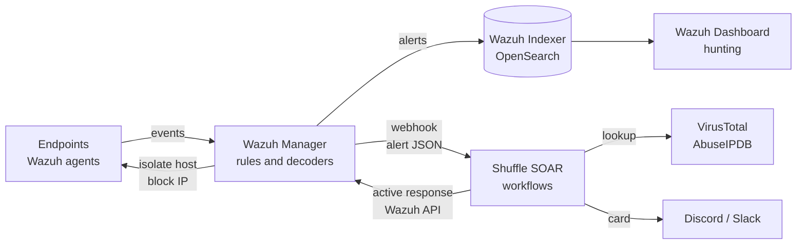

# 🛡️ Modern Security Automation Lab

A lightweight, self-hosted **Active Defense & Threat Hunting** environment utilizing a cloud-native
SIEM and SOAR pipeline, running on a single DigitalOcean droplet.

> **Status: 🚧 in progress.** The lab is being built now. This README describes the design and the
> roadmap; configuration, playbooks and scripts are added to this repository as each phase lands.

## 🚀 Lab Architecture

* **SIEM / Telemetry Engine:** Wazuh Manager (Single-node OpenSearch architecture)
* **SOAR / Orchestration:** Shuffle SOAR (Resource-optimized container setup)
* **Host Footprint:** Ubuntu Server (2 vCPUs, 4GB RAM, 4GB Swap optimization)
* **Hosting:** DigitalOcean droplet, both stacks deployed with Docker Compose



## 🧭 Who, what, when, where, why

| | |
|---|---|
| **Who** | Built and run by Alex S. For SOC analysts and security engineers who want to practise detection and response automation without an enterprise budget. |
| **What** | An open-source SIEM (Wazuh) wired to an open-source SOAR (Shuffle), so an alert is enriched, reported and contained without a person in the loop. |
| **When** | Used for hands-on practice, for testing detections and playbooks before they go near production, and as a demo environment. |
| **Where** | One Ubuntu Server droplet on DigitalOcean: 2 vCPUs, 4 GB RAM, 4 GB swap. |
| **Why** | To prove the detect, enrich, notify and respond loop end to end on a budget, and to keep a vendor-neutral counterpart to the Microsoft Sentinel work in this portfolio. |

## 🎯 Active Initiatives

| Initiative | What it does | Status |
|---|---|---|
| **Automated Triage** | Streaming Wazuh security alerts into Shuffle via a webhook pipeline. | 🚧 In progress |
| **Context Enrichment** | Automating Threat Intel lookup (VirusTotal & AbuseIPDB APIs) via Shuffle nodes. | 🚧 In progress |
| **ChatOps Alerts** | Formatting and forwarding high-priority events into actionable Discord/Slack cards. | 🚧 In progress |
| **Active Response** | Orchestrating remote machine isolation and attacker IP blocks straight from Shuffle playbooks. | 🚧 In progress |

### How the pipeline fits together

1. **Detect.** A Wazuh agent sends events to the manager, and a rule fires an alert.
2. **Hand off.** Wazuh's integration for Shuffle posts the alert as JSON to a Shuffle webhook.
   Only alerts at or above a chosen rule level are forwarded, to keep noise out of the playbooks.
3. **Enrich.** The workflow pulls the IPs and file hashes out of the alert and looks them up in
   VirusTotal and AbuseIPDB.
4. **Decide.** The workflow scores the result: known-bad, suspicious or benign.
5. **Notify.** High-priority events go to Discord or Slack as a card with the alert, the verdict
   and the evidence.
6. **Respond.** For confirmed threats, the workflow calls the Wazuh API to trigger an active
   response on the agent: isolate the machine or block the attacker's IP.

## 📈 System Health & Maintenance

* Monitor host memory load: `free -h`
* Check SIEM cluster status: `docker compose -f /root/wazuh-docker/single-node/docker-compose.yml ps`
* Check SOAR cluster status: `docker compose -f /root/Shuffle/docker-compose.yml ps`

### Running both stacks in 4 GB

Wazuh and Shuffle each ship their own OpenSearch, so two search engines share one small host.
That is the main constraint of this footprint and the reason for the swap file.

* OpenSearch needs the kernel setting `vm.max_map_count=262144`; set it in `/etc/sysctl.conf`
  so it survives a reboot.
* Each OpenSearch JVM heap has to be capped well below the defaults, or the two will fight for
  memory and the kernel will kill one.
* Swap keeps the host alive under load at the cost of speed. If `free -h` shows swap in constant
  use, the next step is a larger droplet, not more swap.
* Both stacks expose web interfaces and an OpenSearch port; check for port clashes when both
  compose files are up.

## 🗺️ Roadmap

### Phase 1: Foundation and first playbook (🚧 in progress)

- [ ] Wazuh single-node stack running on the droplet
- [ ] Shuffle stack running alongside it within the 4 GB budget
- [ ] Wazuh alerts streaming into a Shuffle webhook
- [ ] VirusTotal and AbuseIPDB enrichment nodes
- [ ] Discord / Slack alert cards for high-priority events
- [ ] Active response from Shuffle: isolate a machine, block an attacker IP

### Phase 2: Make it reproducible

- [ ] Commit the configuration to this repository: compose overrides, the Wazuh integration
      block, memory settings (`scripts/`, `docs/`)
- [ ] Export the Shuffle workflows as JSON (`examples/`)
- [ ] Sample alerts with expected playbook output, so a workflow can be tested without an attack
- [ ] Architecture and data-flow diagrams (`diagrams/`)
- [ ] One-command rebuild of the droplet with Terraform (DigitalOcean provider) and cloud-init

### Phase 3: Harden the lab itself

- [ ] DigitalOcean Cloud Firewall: dashboards reachable only from a trusted IP or VPN
- [ ] Run the stacks as a non-root user, out of `/root`
- [ ] Replace default passwords and self-signed certificates
- [ ] API keys in a secrets file outside the repository, checked by the
      [soc-toolkit](https://github.com/as70023333/soc-toolkit) secrets scanner
- [ ] Off-host backup of Wazuh configuration and Shuffle workflows

### Phase 4: Detection engineering

- [ ] Custom Wazuh rules and decoders mapped to MITRE ATT&CK
- [ ] File integrity monitoring, vulnerability detection and configuration assessment on the agents
- [ ] Windows and Linux test endpoints with Sysmon and auditd
- [ ] Attack simulation with Atomic Red Team to prove each rule fires
- [ ] A coverage map: which ATT&CK techniques the lab detects, and which it does not

### Phase 5: More automation

- [ ] Approval step in chat before disruptive actions ("Isolate host? ✅ / ❌")
- [ ] Guardrails: never isolate the lab's own host or block known-good IPs
- [ ] One-click rollback of an isolation or an IP block
- [ ] Case tracking for every alert a playbook handles
- [ ] Reuse `ioc-enrich` from [soc-toolkit](https://github.com/as70023333/soc-toolkit) for wider
      threat-intel coverage
- [ ] Time-to-contain metrics, measured against the 28-second target of the
      [Autonomous SOC Analyst](https://github.com/as70023333/Security_Automation_Projects/tree/main/autonomous-soc-analyst)

## 📁 Repository layout

```
.
├── README.md
├── docs/        # build notes and runbooks (Phase 2)
├── scripts/     # host setup and maintenance scripts (Phase 2)
├── diagrams/    # architecture and data-flow diagrams (Phase 2)
└── examples/    # exported Shuffle workflows and sample alerts (Phase 2)
```

## 🔗 Built with

* [Wazuh](https://github.com/wazuh/wazuh-docker): open-source SIEM and XDR (single-node Docker deployment)
* [Shuffle](https://github.com/Shuffle/Shuffle): open-source SOAR
* [DigitalOcean](https://www.digitalocean.com/): hosting

## 🧩 Related projects

* [soc-toolkit](https://github.com/as70023333/soc-toolkit): KQL hunting library, IOC enrichment,
  secrets scanner and Microsoft security audits
* [Autonomous SOC Analyst](https://github.com/as70023333/Security_Automation_Projects/tree/main/autonomous-soc-analyst):
  the same detect, enrich, contain and report loop as a rule-based agent
* [phish-triage-agent](https://github.com/as70023333/phish-triage-agent): autonomous triage of
  reported phishing email

---

Developed by **Alex S., Security**
